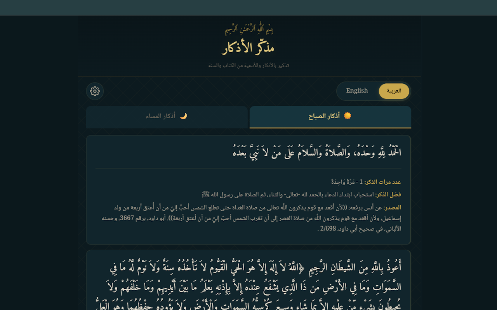
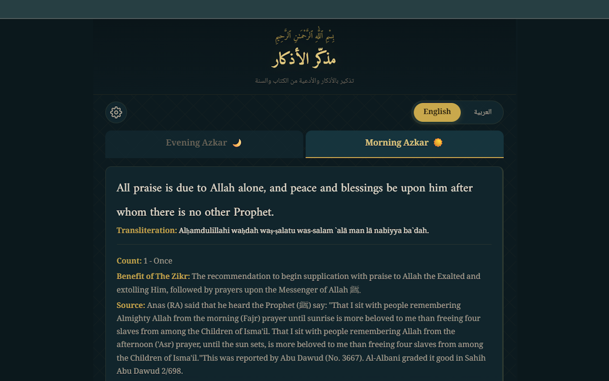
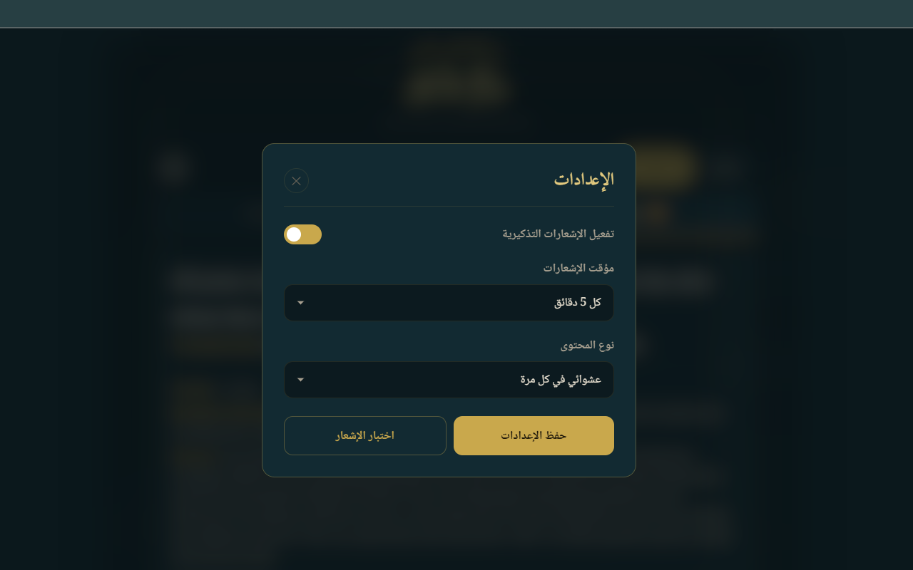

# Azkar Reminder Extension

إضافة للمتصفح تتذكرك بالأذكار والأدعية بشكل مستمر وبها اذكار الصباح والمساء ومترجمة للغة الإنجليزية
كل مدة يتم سيتم عرض لك دعاء عشوائي على هيئة اشعار يأتيك من خلال المتصفح

أذكار الصباح والمساء مأخوذة من مشروع [Morning-And-Evening-Adhkar-DB](https://github.com/Seen-Arabic/Morning-And-Evening-Adhkar-DB)  
والأدعية مأخوذة من: 

- كتاب `100` دعاء من الكتاب والسنة الصحيحة للشيخ محمد صالح المنجد [100-duaa-from-the-book-and-authentic-sunnah](https://github.com/AhmedElTabarani/100-duaa-from-the-book-and-authentic-sunnah)  
- كتاب مجموع الأذكار للشيخ الدكتور سعيد بن علي بن وهف القحطاني [duaa-of-magmu-azkar-book](https://github.com/AhmedElTabarani/duaa-of-magmu-azkar-book)  

## أذكار الصباح والمساء

الإضافة تحتوي على أذكار الصباح والمساء

ويوجد ترجمة انجليزية للأذكار

## التحكم في الإشعارات

- **تفعيل/إيقاف الإشعارات**: يمكنك الآن إيقاف الإشعارات التذكيرية كلياً أو تفعيلها حسب الحاجة
- **مؤقت مخصص**: اختر من بين عدة خيارات لفترة ظهور الإشعارات:
  - كل دقيقة
  - كل 5 دقائق (افتراضي)
  - كل 10 دقائق
  - كل 15 دقيقة
  - كل 30 دقيقة
  - كل ساعة
  - كل ساعتين
  - كل 3 ساعات
- **اختبار الإشعارات**: زر لاختبار الإشعار فوراً

## أنواع الأذكار المتاحة

يمكنك الاختيار من بين أربعة أنواع مختلفة من المحتوى

1. **100 دعاء من الكتاب والسنة**
2. **أذكار الصباح والمساء**
3. **أدعية من كتاب مجموع الأذكار**
4. **دعاء عشوائي**

## رابط الإضافة على متجر جوجل كروم

## يوجد مشكلة !!

افتح issue إذا قابلت مشكلة ما أو إذا كان لديك أي اقتراح

## المساهمة

بالطبع نرحب بأي مساهمة لدينا ❤

